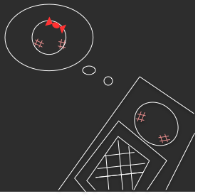

# 独り身ルンルン

## 製品概要
### 彼女 x Tech

### 背景
楽しくない飲み会で帰る言い訳がほしい。
友達に彼女がいるとうそをついていて誤魔化したい。
女友達がたくさんいることを自慢したい。

### 製品説明（具体的な製品の説明）
例えば上司との飲み会で帰りたいときに、このアプリで通知が来るように設定をすれば、あたかも彼女から連絡が来まくって帰らなければいけないという状況を作り出せる。
友達に強がって彼女がいるって言ってしまったけど、彼女から連絡がこないとあやしまれるから、通知が来るようにして誤魔化したい。
このアプリを使えば、女の子からめっちゃ連絡が来るモテ男、彼女持ちのリア充になれる！

### 特長

#### 1. Twitterの画像を利用

#### 2. あらかじめ連絡のパターンや時間を設定できる

### 解決出来ること
彼女からの連絡を利用することでめんどくさい飲み会を回避したり、友達に強がることができる。

### 今後の展望
* 何分おきかに通知する機能の実装
* メンヘラモードなどの特定のモードを実装

## 開発内容・開発技術
### 活用した技術
#### API・データ
* TwitterAPI

#### フレームワーク・ライブラリ・モジュール
* KingFisher
* Realm
* SKPhotoBrowser

#### デバイス
* iPhone(iOS11.0~)

### 独自開発技術（Hack Dayで開発したもの）
#### 2日間に開発した独自の機能・技術
* TwitterAPIによる画像の取得
* ローカルへの画像保存
* 通知パターン一覧画面
* 通知パターン入力画面
* アラーム一覧画面
* アラーム入力画面
* ローカル通知機能
